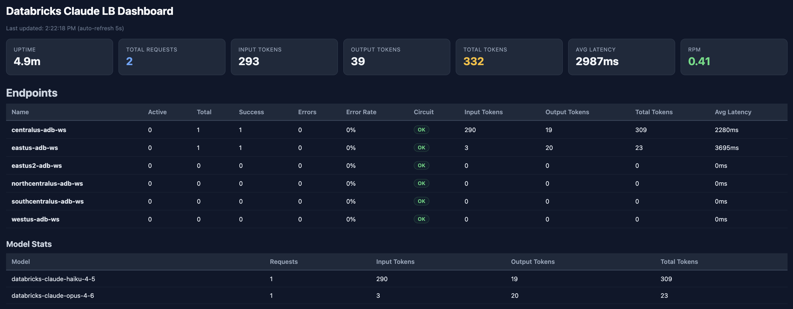

# Databricks Claude Load Balancer

一个智能负载均衡代理，统一对接 **Databricks Claude**、**Azure OpenAI** 和 **GitHub Copilot** 三套上游，按模型自动路由。

## 为什么需要这个项目？

- **突破单一 workspace/区域限制**：通过多个端点分散请求，提高整体吞吐量
- **三路供给，单一入口**：Anthropic 走 Databricks，OpenAI/Gemini 系列优先 GHCP、回退 Azure，客户端只需一份 base URL
- **高可用性**：内置熔断器、token 自愈、上游 HTML 错误兜底
- **成本追踪**：内置模型定价，自动计算每日使用成本，支持 JSON/MySQL 持久化
- **生产部署友好**：JSON 结构化日志、Prometheus `/metrics`、`/health/{live,ready}` 探针、K8s Secret rotation 零重启生效

## 功能特性

- **三路统一**
  - Databricks Claude（`/v1/messages`）— 多 workspace 负载均衡
  - GitHub Copilot（`/v1/chat/completions`、`/v1/responses`）— 多账号 + Device Flow 登录 + token 自动刷新
  - Azure OpenAI（`/v1/chat/completions`、`/v1/responses`）— 多区域 + 按 deployment 路由
- **自动路由** - `claude-*` 永远走 Databricks；其他模型 **GHCP 优先 → Azure fallback**
- **GHCP token 自愈** - long-lived OAuth + 30 min session token 双层模型；后台定时刷新 + 401 自愈 + 配合 K8s Secret rotation 零重启生效
- **图片自动压缩** - >200KB base64 image → ≤1280px JPEG q=82，让 Chrome fullPage 截图（30MB 级）也能塞进 ADB 4MB 上限
- **上游错误规范化** - 自动把上游 HTML 错误页（CDN "Connection Closed" 之类）转成结构化 JSON，避免泄露给客户端
- **负载均衡** - `least_requests`（默认）/ `round_robin` / `random`
- **熔断器** - 自动检测故障端点并临时禁用，超时后自动恢复
- **流式响应** - SSE 流式 + 15s keep-alive 心跳 + `RemoteProtocolError` 等中断恢复 + 已发送 chunk 后正确 `message_stop` 终止
- **Extended Thinking** - 支持 Claude Opus/Sonnet 的 adaptive 思考模式（含旧模型自动降级 `enabled` + budget_tokens）
- **Prompt Caching** - 自动清理 `cache_control` 额外字段（如 `scope`），兼容 Databricks
- **用量持久化** - 按天存储 token 用量，JSON 文件 或 MySQL 8.x 后端，重启自动恢复
- **Dashboard** - 四标签页（Anthropic / Azure / GitHub Copilot / 历史），深色 / 浅色主题切换
- **可观测性** - JSON 日志（`LOG_FORMAT=json`）+ Prometheus `/metrics` + K8s livenessProbe / readinessProbe

## 快速开始

### 1. 克隆项目

```bash
git clone https://github.com/yourusername/databricks-claude-lb.git
cd databricks-claude-lb
```

### 2. 安装依赖

```bash
pip install -r requirements.txt

# 如需 MySQL 存储后端（可选）
pip install aiomysql
```

### 3. 配置端点

复制示例配置文件：

```bash
cp config.yaml.example config.yaml
```

编辑 `config.yaml`，填入你的端点信息：

```yaml
load_balancer:
  strategy: least_requests        # 负载均衡策略
  circuit_breaker_threshold: 5    # 熔断器错误阈值
  circuit_breaker_timeout: 60     # 熔断器恢复超时（秒）

auth:
  api_key: your-secret-api-key    # 自定义的 API Key

# Databricks 端点配置
endpoints:
  - name: workspace-1
    api_base: https://adb-xxx.azuredatabricks.net/serving-endpoints
    token: dapi_xxx               # Databricks Personal Access Token
    weight: 1

  - name: workspace-2
    api_base: https://adb-yyy.azuredatabricks.net/serving-endpoints
    token: ${DATABRICKS_TOKEN_2}  # 支持环境变量
    weight: 1

# Token 用量持久化（可选）
# 简单模式：JSON 文件
usage_data_dir: ./usage_data

# 高级模式：支持 JSON 或 MySQL + 自动清理
# usage_storage:
#   type: mysql                   # json 或 mysql
#   host: localhost
#   port: 3306
#   user: root
#   password: ${MYSQL_PASSWORD}
#   database: claude_lb
#   retention_days: 90            # 自动清理超过 N 天的数据

# Azure OpenAI 端点配置（可选）
# azure_openai:
#   endpoints:
#     - name: eastus-region
#       endpoint: https://my-openai-eastus.openai.azure.com
#       api_key: ${AZURE_KEY_EASTUS}
#       deployments: [gpt-4o, gpt-5]
#       weight: 1

# GitHub Copilot 端点配置（可选）
# github_copilot:
#   endpoints:
#     - name: gh-account-1            # 见下方"GitHub Copilot 端点配置"详解
#       weight: 1
#       models: []                    # 空 = 通配（接受所有上游支持的模型）
```

### 4. 启动服务

```bash
python main.py
```

或使用 uvicorn 带热重载：

```bash
uvicorn main:app --host 0.0.0.0 --port 8000 --reload
```

服务将在 `http://localhost:8000` 启动。

### 5. 配置 Claude Code

设置环境变量后启动 Claude Code：

```bash
export ANTHROPIC_BASE_URL='http://localhost:8000'
export ANTHROPIC_API_KEY='your-secret-api-key'  # 与 config.yaml 中的 api_key 一致

claude
```

## Docker 部署

### 构建镜像

```bash
docker build -t claude-lb .
```

### 运行容器

```bash
docker run -d \
  --name claude-lb \
  -p 8000:8000 \
  -v $(pwd)/config.yaml:/app/config.yaml \
  -v $(pwd)/usage_data:/app/usage_data \
  claude-lb
```

### Docker Compose（可选）

创建 `docker-compose.yaml`：

```yaml
version: '3.8'
services:
  claude-lb:
    build: .
    ports:
      - "8000:8000"
    volumes:
      - ./config.yaml:/app/config.yaml
      - ./usage_data:/app/usage_data
    restart: unless-stopped
```

运行：

```bash
docker-compose up -d
```

## API 端点

| 端点 | 方法 | 认证 | 描述 |
|------|------|------|------|
| `/v1/messages` | POST | 需要 | Databricks Claude 消息 API（仅 `claude-*` 模型） |
| `/v1/messages/count_tokens` | POST | 不需要 | Token 计数估算 |
| `/v1/responses` | POST | 需要 | OpenAI Responses API（按模型分流：Copilot 优先 → Azure fallback；`claude-*` 拒绝） |
| `/v1/chat/completions` | POST | 需要 | OpenAI Chat Completions API（按模型分流：同上） |
| `/health`、`/health/live` | GET | 不需要 | Liveness probe（仅检查进程） |
| `/health/ready` | GET | 不需要 | Readiness probe（检查依赖；故障返回 503 + `issues` 数组） |
| `/metrics` | GET | 不需要 | Prometheus 文本格式 metrics（K8s / Azure Monitor 抓取） |
| `/admin/copilot/reload` | POST | 需要 | 运维端点：从源重读所有 Copilot endpoint 的 long-lived token + 强制刷新 session（K8s Secret rotation 后立刻生效） |
| `/stats` | GET | 不需要 | 端点统计（含成本估算、Azure OpenAI、GitHub Copilot） |
| `/stats/history` | GET | 不需要 | 历史用量数据（`?days=7`） |
| `/stats/history` | DELETE | 不需要 | 清理历史数据（`?keep_days=30`） |
| `/stats/dashboard` | GET | 不需要 | 可视化监控面板（四标签页 + 主题切换） |
| `/reset` | POST | 不需要 | 重置内存统计（持久化数据保留） |

### Dashboard



Dashboard 包含四个标签页：
- **Anthropic Models** - 实时 Databricks 端点状态、模型统计、成本估算
- **Azure OpenAI Models** - Azure 端点状态和统计
- **GitHub Copilot** - GHCP 端点 token 剩余时间、模型用量、假想成本（按 OpenAI 公开定价）
- **Usage History** - 历史用量表格、成本趋势、数据清理操作

**主题切换**：右上角的太阳 / 月亮按钮可在深色与浅色主题间切换。首次打开跟随操作系统 `prefers-color-scheme`；手动切换后写入 `localStorage['lb-theme']`，下次访问自动恢复。图表（Chart.js）会同步更新 legend、tooltip、grid、ticks 颜色，无需刷新页面。

## 支持的模型

### Databricks Claude

| Claude 模型 | Databricks 模型 |
|------------|-----------------|
| claude-*-sonnet-* | databricks-claude-sonnet-4-6（默认），支持显式指定 4-5/4-6 |
| claude-*-opus-* | databricks-claude-opus-4-7（默认），支持显式指定 4-5/4-6/4-7 |
| claude-*-haiku-* | databricks-claude-haiku-4-5 |

### Azure OpenAI

Azure OpenAI 端点无需模型名映射，请求中的 `model` 字段直接对应 Azure 上的 deployment 名称（如 `gpt-4o`, `gpt-5`, `o4-mini`）。代理会自动将请求路由到拥有该 deployment 的端点。

### GitHub Copilot

GitHub Copilot 端点同样以 `model` 字段直传上游（如 `gpt-5.5`、`gpt-5-codex`、`claude-3.5-sonnet` 也会被 GHCP 接受）。和 Azure 不同的是，**GHCP 的 `models` 字段语义为白名单且空列表 = 通配**——不强制静态配置，因为 GHCP 上游模型列表会变化。

> **注意**：GHCP 部分新模型（如 `gpt-5.5`、`gpt-5-codex`）**只允许走 `/responses` API**，不允许走 `/chat/completions`，这是 GHCP 上游的强约束。Codex Desktop 默认 `wire_api = "responses"`，OK；其他客户端需要确认。

## GitHub Copilot 端点配置

> 关键点：每个 endpoint 的 `name` 字段是**你自己选的逻辑标识符**，配置后有 4 个用途，所以选一个稳定、好记、跨账号唯一的名字。

### `name` 字段做了什么

```yaml
github_copilot:
  endpoints:
    - name: gh-account-1     # ← 这个 name
      weight: 1
      models: []
```

| 用途 | 行为 |
|---|---|
| **本地 token 缓存文件名** | `~/.config/databricks-claude-lb/copilot-auth-<sanitized-name>.json`（非法字符 `[^A-Za-z0-9._-]` 会被替换成 `_`） |
| **Device Flow CLI 入参** | `python main.py --copilot-login --endpoint <name>` 决定登录后 token 写到哪个文件 |
| **K8s Secret 文件名** | mounted Secret 必须以 `copilot-auth-<name>.json` 命名才能被 LB 自动 pick up |
| **日志 / Dashboard / `/stats` 标识** | `[Copilot] resolved token for 'gh-account-1' from ...`，多账号时方便区分 |

> 多账号场景：`name` 必须唯一，例如 `gh-personal`、`gh-corp`、`gh-team-shared`。同一台机器跑多个 endpoint 时各自的 token 缓存文件互不影响。

### Token 来源（按优先级回退）

`resolve_github_token(endpoint)` 按下列顺序找一个 long-lived OAuth token：

1. **`config.yaml` 显式配置**（推荐生产环境）
   ```yaml
   github_copilot:
     endpoints:
       - name: gh-account-1
         github_token: ${GITHUB_COPILOT_TOKEN_1}    # 支持环境变量
   ```
   - K8s 场景配合 Secret 注入：`envFrom.secretRef.name: claude-lb-secrets` + `GITHUB_COPILOT_TOKEN_1` 在 Secret 里
2. **本项目 device-flow 缓存**（推荐本地开发）
   - 路径：`~/.config/databricks-claude-lb/copilot-auth-<name>.json`，权限 0600
   - 由 `python main.py --copilot-login --endpoint <name>` 写入
3. **兼容 copilot-lb 旧缓存**：`~/.config/copilot-lb/auth.json`（无 name 区分，全局共用）

> 任一来源拿到 token 后，每次请求自动用它去 `https://api.github.com/copilot_internal/v2/token` 交换 30 min 短期 session token。后台定时任务（默认 300 s 扫一遍，剩 ≤600s 主动刷新）+ 请求级 401 自愈让你**永远不需要手动刷新短期 token**。

### Device Flow 登录步骤

需要能开浏览器的机器，登录一次即可（long-lived token 一般不过期，除非用户主动 revoke）：

```bash
python main.py --copilot-login --endpoint gh-account-1
```

终端会打印 verification URL + user code，去浏览器输入即可。完成后：
- token 写入 `~/.config/databricks-claude-lb/copilot-auth-gh-account-1.json`（mode 0600）
- AKS 部署时把这个文件作为 Secret 上传即可（见 `docs/AKS.md`）

### 多账号示例

```yaml
github_copilot:
  load_balancer:
    strategy: least_requests
    circuit_breaker_threshold: 5
    circuit_breaker_timeout: 60
  endpoints:
    - name: gh-personal
      weight: 2                       # 优先级更高
      models: []                      # 通配
    - name: gh-corp
      weight: 1
      models: [gpt-5.5, gpt-5-codex]  # 仅服务这俩模型
```

每个 endpoint 各自登录：
```bash
python main.py --copilot-login --endpoint gh-personal
python main.py --copilot-login --endpoint gh-corp
```

### 路由规则速览

```
                  ┌─────────────────────────────────────────────────┐
                  │ /v1/chat/completions, /v1/responses             │
                  └────────────────┬────────────────────────────────┘
                                   │
                  ┌────────────────▼────────────────┐
                  │  model 名包含 "claude" ？        │
                  └────────────────┬────────────────┘
                       是          │           否
              ┌────────────────────┘           └─────────────┐
              ▼                                              ▼
   400 拒绝（必须走 /v1/messages）          ┌─────────────────────────┐
                                            │ Copilot can_handle ?    │
                                            └────────┬────────────────┘
                                              是     │     否
                                       ┌────────────┘     └──────────┐
                                       ▼                              ▼
                                 GHCP 优先尝试                  Azure 直接尝试
                                       │
                       ┌───────────────┴───────────────┐
                       ▼                               ▼
                    成功                            失败（unsupported_model
                  返回 200                         / 503 / 全熔断）
                                                       │
                                            ┌──────────▼──────────┐
                                            │ Azure 有该 deployment？ │
                                            └──────────┬──────────┘
                                              是       │       否
                                          ┌───────────┘       └──────────┐
                                          ▼                              ▼
                                        Azure 接管                  返回结构化 503
                                                                    （含原 Copilot 失败原因）
```

### Codex Desktop 配置示例

`~/.codex/config.toml`：

```toml
model_provider = "claude-lb"
model = "gpt-5.5"
model_reasoning_effort = "high"

[model_providers.claude-lb]
name = "claude-lb"
base_url = "http://127.0.0.1:8000/v1"   # 注意用 127.0.0.1 而非 localhost
                                         # 见 docs/TROUBLESHOOTING.md 关于 macOS 系统代理
wire_api = "responses"                   # GHCP gpt-5.x 必须走 /responses
env_key = "OPENAI_API_KEY"
```

环境变量 `OPENAI_API_KEY` 设为与 LB `config.yaml` 中 `auth.api_key` 一致即可。

## 请求兼容性处理

代理会自动处理 Claude Code 请求与 Databricks 之间的兼容性差异：

| 处理项 | 说明 |
|--------|------|
| 模型名映射 | `claude-opus-4-7` → `databricks-claude-opus-4-7` |
| Thinking 参数 | Opus 4.6+/Sonnet 4.6+ 使用 `adaptive`；旧模型自动转换为 `enabled` + `budget_tokens` |
| cache_control | 自动 strip `scope` 等额外字段，保留 `{"type": "ephemeral"}` 支持 prompt caching |
| 不支持的字段 | 自动移除 `context_management`、`output_config`、`defer_loading`、`input_examples`、`tool_reference` |

## 用量持久化与成本追踪

### 存储后端

> **三路上游统一记账**：Databricks Claude、Azure OpenAI、GitHub Copilot 三个 Proxy 都调用同一个 `usage_store.record()`，所以 GHCP 用量也会按天落盘 + 重启自动恢复 + 出现在 `/stats/history` 和 Dashboard 的 Usage History 中。

**JSON 文件（默认）**
- 目录结构：`{usage_data_dir}/{YYYY}/{MM}/{YYYY-MM-DD}.json`
- 无需额外依赖

**MySQL 8.x（可选）**
- 需要安装 `aiomysql`：`pip install aiomysql`
- 自动创建 `usage_daily` 表（schema：`(date, model)` 联合主键 + token / 请求计数列）
- 配置 `usage_storage.type: mysql`
- ⚠️ 当前 schema **不区分 provider**：若同一个 `model` 名在 GHCP 和 Azure 都跑，统计会合并到同一行（实际场景里模型名分布天然不重叠）

### 成本估算

内置 Anthropic 官方定价，自动计算各模型的使用成本：

| 模型系列 | Input $/MTok | Output $/MTok | Cache Write $/MTok | Cache Read $/MTok |
|---------|-------------|---------------|--------------------|--------------------|
| Opus | $5.00 | $25.00 | $6.25 | $0.50 |
| Sonnet | $3.00 | $15.00 | $3.75 | $0.30 |
| Haiku | $1.00 | $5.00 | $1.25 | $0.10 |

### 历史数据清理

- **自动清理**：配置 `retention_days`，启动时和每日自动执行
- **API 清理**：`DELETE /stats/history?keep_days=30`
- **Dashboard**：History 标签页内置清理面板

## 负载均衡策略

| 策略 | 说明 |
|------|------|
| `least_requests` | 选择当前活跃请求数最少的端点（默认，推荐） |
| `round_robin` | 轮询方式分配请求 |
| `random` | 随机选择端点 |

## 熔断器机制

- 当某个端点连续发生 `circuit_breaker_threshold` 次服务端错误时，熔断器开启
- 熔断器开启后，该端点在 `circuit_breaker_timeout` 秒内不会收到新请求
- 超时后自动恢复，错误计数重置
- 客户端错误（4xx，除 429）不触发熔断器
- 可通过 `/reset` 端点手动重置所有熔断器

## 架构说明

```
                                                  ┌─────────────────────┐
                                            ┌────►│ Databricks WS 1     │
                                            │     ├─────────────────────┤
                                            │     │ ...                 │
┌──────────────┐     ┌──────────────────┐   │     │ Databricks WS N     │
│ Claude Code  │────►│ /v1/messages     │───┘     └─────────────────────┘
│ (claude-*)   │     │                  │
└──────────────┘     │ Load Balancer    │
                     │ + 路由分流       │         ┌─────────────────────┐
                     │                  │   ┌────►│ GitHub Copilot      │
┌──────────────┐     │ /v1/chat/        │   │     │ (gh-account-1, ...) │
│ Codex /      │────►│  completions     │───┤     └─────────────────────┘
│ openclaw /   │     │ /v1/responses    │   │     ┌─────────────────────┐
│ OpenAI 客户端│     │                  │   └────►│ Azure OpenAI        │
└──────────────┘     │ • token 自愈     │         │ (eastus2 / sweden / │
                     │ • 图片自动压缩   │         │  ...)               │
                     │ • HTML 错误转 JSON│        └─────────────────────┘
                     │ • SSE 心跳       │
                     │ /metrics /health │
                     └──────────────────┘

模型路由：
  claude-*           → Databricks（不 fallback）
  其他（gpt-* / etc.）→ Copilot 优先；失败 / 不支持 → Azure fallback
```

## 环境变量

| 变量 | 描述 | 默认值 |
|------|------|--------|
| `CONFIG_PATH` | 配置文件路径 | `config.yaml` |
| `LOG_FORMAT` | 日志格式（`json` / `text`） | `text` |
| `LOG_LEVEL` | 日志级别 | `INFO` |
| `COPILOT_REFRESH_INTERVAL` | GHCP session token 后台刷新扫描间隔（秒） | `300` |
| `COPILOT_REFRESH_THRESHOLD` | session token 剩余 ≤ 此秒数时主动刷新 | `600` |
| `ANTHROPIC_BASE_URL` | Claude Code 指向代理地址 | - |
| `ANTHROPIC_API_KEY` | 与 config.yaml 中 api_key 一致 | - |
| `OPENAI_API_KEY` | Codex / OpenAI 客户端用，与 api_key 一致 | - |
| `AZURE_KEY_*` | Azure OpenAI API 密钥 | - |
| `GITHUB_COPILOT_TOKEN_*` | GHCP long-lived OAuth token（K8s Secret 注入） | - |
| `MYSQL_PASSWORD` | MySQL 密码（如使用 MySQL 存储） | - |

配置文件中的 token/api_key/password 支持环境变量语法：`${ENV_VAR_NAME}`

## 生产部署 (AKS / K8s)

完整的 Kubernetes / AKS 部署清单和 Token rotation 流程见 **[`docs/AKS.md`](docs/AKS.md)**。

要点速览：

- `deploy/k8s/` 已经准备好可直接 `kubectl apply -k` 的 Kustomize 清单（Deployment / Service / ConfigMap / PVC + secret 示例）
- **Token rotation 零重启**：把 device-flow 生成的 `copilot-auth-<name>.json` 作为 K8s Secret 挂到 `/home/app/.config/databricks-claude-lb/`；rotate Secret 后 kubelet 自动同步（约 1 min）+ LB 后台刷新自动 pick up；要立刻生效就调一次 `POST /admin/copilot/reload`
- **liveness / readiness 已分离**：`/health/live` 仅查进程，`/health/ready` 查依赖（至少 1 个 ADB endpoint 可用 + 至少 1 个 Copilot endpoint token 有效）
- **Prometheus / Azure Monitor managed Prometheus**：`/metrics` 端点 + `prometheus.io/scrape: "true"` 注解已配
- **JSON 日志**：`LOG_FORMAT=json` 让 Azure Log Analytics 可直接 KQL 解析

故障排查见 **[`docs/TROUBLESHOOTING.md`](docs/TROUBLESHOOTING.md)**：含 macOS 系统代理拦截 localhost、Claude Code 32MB 客户端限制、Databricks 4MB 上限、GHCP 模型 API 约束等常见坑。

## 前置条件

- Python 3.10+
- 至少一个启用了 Claude 模型的 Databricks workspace
- Databricks Personal Access Token
- （可选）Azure OpenAI 资源及 API Key
- （可选）MySQL 8.x（如使用 MySQL 存储后端）

## 常见问题

**Q: 为什么三个端点的请求数不均衡？**

A: `least_requests` 策略基于当前活跃请求数分配，而非总请求数。处理速度快的端点会接收更多请求，这是合理的负载均衡行为。

**Q: 熔断器触发后如何恢复？**

A: 等待 `circuit_breaker_timeout` 秒后自动恢复，或调用 `POST /reset` 手动重置。

**Q: 支持哪些 Claude 模型？**

A: 支持 Opus 4.5/4.6/4.7、Sonnet 4.5/4.6、Haiku 4.5。默认映射到各系列最新版本（Opus → 4.7，Sonnet → 4.6）。

**Q: Prompt caching 是否生效？**

A: 是的。代理会保留 `cache_control: {"type": "ephemeral"}`，仅 strip 掉 Databricks 不支持的额外字段（如 `scope`），因此 prompt caching 正常工作。

**Q: 用量数据在服务重启后会丢失吗？**

A: 不会。用量数据按天持久化到 JSON 文件或 MySQL，重启时自动恢复当天数据；Dashboard 的 KPI Est. Cost 和 Anthropic Models 表也基于该恢复值，不会因重启回零。

**Q: 如何切换到 MySQL 存储？**

A: 安装 `pip install aiomysql`，然后在 config.yaml 中配置 `usage_storage.type: mysql` 及数据库连接信息。

**Q: 偶尔报 `API Error: The socket connection was closed unexpectedly` 怎么办？**

A: 已在 v 最新版修复。代理现在会：
1. 捕获 httpx 的 `RemoteProtocolError`/`ReadError`/`WriteError` 等上游中断异常并触发重试（未发送 `message_start` 前切换端点）
2. 已向客户端 yield 过 `message_start` 后若上游失败，补发合法的 `message_stop` + `error` 事件，让 Anthropic SDK 正常结束流而不是看到 socket 被断
3. 流式响应期间每 15s 发送 `: keep-alive\n\n` SSE 注释心跳，防止中间链路（NAT/反代）因空闲关闭连接
4. httpx `read` 超时改为 `None`（流式请求由 chunk 节拍保证），配合 uvicorn `timeout_keep_alive=600`，可承受 >5 分钟的长 thinking 响应
5. `response.aclose()` 在 `finally` 分支执行，避免连接池被半开连接占满

如果更新后仍有复现，检查日志中是否有 `Stream network error on ...: RemoteProtocolError/ReadError` 字样，对应端点可能需要检查网络或熔断阈值。

## License

MIT
