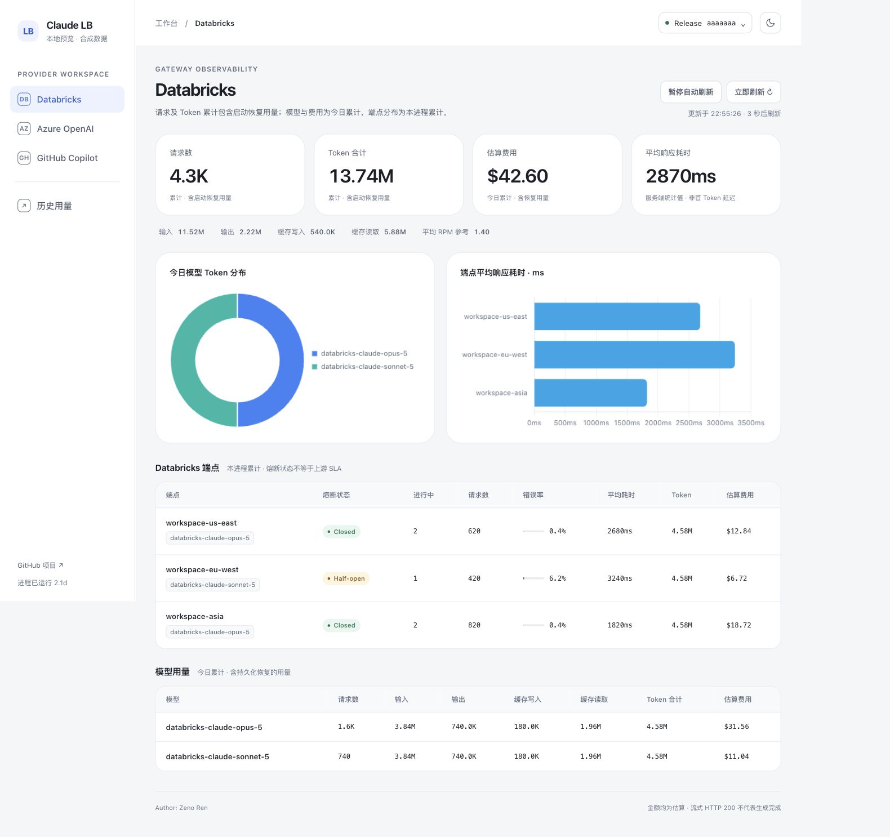

# Databricks Claude Load Balancer

Author: Zeno Ren

为 Claude Code、OpenAI 兼容客户端和内部工具提供统一的模型网关：接入 Databricks、Azure OpenAI 与 GitHub Copilot，管理端点分流、保守重试、流式协议、用量持久化和运行观测。

[快速开始](#快速开始) · [配置与客户端](docs/CONFIGURATION.md) · [Dashboard](#dashboard) · [AKS 发布](docs/AKS.md) · [完整文档](docs/README.md)

## 服务能力

| 渠道 | 客户端入口 | 路由行为 |
|---|---|---|
| Databricks Claude | `/v1/messages` | Claude 模型映射、多 workspace 分流 |
| GitHub Copilot | `/v1/responses`、`/v1/chat/completions` | OpenAI 风格模型优先使用 Copilot；保留账户亲和与有界认证修复 |
| Azure OpenAI | `/v1/responses`、`/v1/chat/completions` | 按已配置 deployment 选择端点；仅在允许的准入/兼容性分支接管 |

网关提供完整 SSE 帧转发、请求 ID 与分阶段诊断、熔断与半开试探、有界并发和输入预算、参数兼容提示，以及 JSON/MySQL 用量后端。图片可以压缩；超量裁剪默认拒绝，必须明确允许。Chat→Responses 适配保留可支持的工具、schema、refusal 和 incomplete 语义。

执行结果不明的推理不会为了“自愈”自动重放；用量落盘失败也不会触发重新生成。HTTP 200 不等于生成完成。具体规则见 [请求契约](docs/OBSERVABILITY_AND_CONTEXT.md) 与 [可靠性约束](docs/RESILIENCE.md)。

## 快速开始

需要 **Python 3.11+**，建议使用 3.12。至少配置一个可用上游；MySQL 8.x 和 Docker 按使用场景选择。推理使用你自己的渠道凭据和额度。

### 1. 安装

```bash
git clone https://github.com/ZenoRewn/databricks-claude-lb.git
cd databricks-claude-lb
python3.12 -m venv .venv
source .venv/bin/activate
python -m pip install -r requirements.lock
cp config.yaml.example config.yaml
```

### 2. 配置

编辑 [config.yaml.example](config.yaml.example) 的本地副本，只保留实际使用的端点。`auth.api_key` 是客户端访问网关的密钥，上游凭据分别配置；支持 `${ENV_VAR_NAME}` 引用。真实 `config.yaml` 已被 Git 和 Docker 构建上下文排除。

```yaml
auth:
  api_key: ${LB_API_KEY}

endpoints:
  - name: workspace-1
    api_base: https://adb-YOUR-WORKSPACE.azuredatabricks.net/serving-endpoints
    token: ${DATABRICKS_TOKEN_1}
    weight: 1
```

在运行环境中设置所引用的变量。Azure deployment、Copilot Device Flow、多账户和存储配置见 [配置指南](docs/CONFIGURATION.md)。

### 3. 启动与接入

```bash
uvicorn main:app --host 127.0.0.1 --port 8000
```

上面的命令仅监听本机 `127.0.0.1:8000`。`python main.py` 是开发入口，监听 `0.0.0.0` 并启用 reload；不要把它当作仅本地监听的生产启动方式。本地 Dashboard 为 [`/stats/dashboard`](http://127.0.0.1:8000/stats/dashboard)。

Claude Code：

```bash
export ANTHROPIC_BASE_URL='http://127.0.0.1:8000'
export ANTHROPIC_API_KEY="$LB_API_KEY"
claude
```

OpenAI 兼容客户端使用 `http://127.0.0.1:8000/v1`，API Key 同样使用网关密钥。Responses-only 模型优先选择 Responses 客户端；其他接入示例见 [客户端配置](docs/CONFIGURATION.md#客户端接入)。

## Dashboard

按渠道查看主要指标、模型分布、端点状态和连接池观测；历史页展示持久化用量。支持深浅主题、暂停/手动刷新、明确的失败提示和需要鉴权确认的数据维护。



*图片为本地合成数据预览，不是生产流量或性能证据。*

统计口径在页面中单独标注：Databricks 请求/Token 累计包含启动时恢复的用量，模型与费用为今日数据；端点、Azure 和 Copilot 页面主要是当前进程统计。历史记录跨进程保留。未知和部分计价不会显示为完整的零费用，估算也不等同于供应商账单。

启用 Copilot 时，服务默认每 7 天后台更新 GitHub 官方模型价格，失败保留有效旧表并显示更新状态；内置 2026-10-01 的 35 个模型价格作为基线。缓存持久化、关闭开关与估算边界见 [Copilot 价格说明](docs/COPILOT_PRICING.md)。左上角汇流标识使用 Azure OpenAI 生成，经选择后接入；[六款候选与生成记录](output/imagegen/lb-logo-20261001/README.md)保留供后续设计参考。

右上角 **Release** 展示实际构建提交，并可打开对应 GitHub commit 或与 `main` 比较：

- **构建文件一致**：运行文件与完整构建记录相符。
- **运行文件有变化**：构建带本地修改或运行文件不匹配。
- **未标注 / 未核验**：缺少可信构建信息；不猜测版本。

版本来自只读 `/version`，不会调用 GitHub API，也不会公开配置和凭据。文件一致不代表 GitHub 已无新提交；页面每分钟更新版本信息，手动刷新会立即核对。运行实例升级后才能看到新的提交，不应拿 README 的最新 commit 冒充线上版本。

## 配置与运维入口

| 任务 | 入口 |
|---|---|
| 配置渠道、认证、存储及客户端 | [配置指南](docs/CONFIGURATION.md) |
| 查接口及鉴权要求 | [完整 API 表](CLAUDE.md#api-端点) |
| 观察进程、依赖、接流量状态 | `/health/live`、`/health/ready`、`/health/accepting` |
| 抓取指标 | `/metrics` 默认 v2；显式 v3 用 `/metrics?schema=lb-metrics-v3` |
| 查看实际参数 | 带有效 LB Key 请求 `/config/effective` |
| 查看历史、模型与费用口径 | [GHCP 计费说明](docs/COPILOT_PRICING.md)、[用量与耐久性](docs/OPERATIONS_EXPERIMENTS.md) |
| 排查连接池、协议、客户端问题 | [排障指南](docs/TROUBLESHOOTING.md) |

JSON 用量后端只支持单写者。MySQL 使用批次账本与增量事务写入，但内存待写事件仍易失，不能承诺节点丢失时零 RPO。`/stats`、历史和指标是运维观测接口，公开范围由部署入口控制。

## 构建与发布

推荐使用构建身份工具，它会绑定当前提交、运行文件 hash 和本地修改状态：

```bash
python -m operations.build_identity \
  --build-tag claude-lb:local \
  --platform linux/amd64
```

本地 Docker 配置挂载、离线依赖和验证流程见 [开发指南](docs/DEVELOPMENT.md)。本地 image ID、registry digest、运行 Pod imageID 和源码提交是不同证据，发布时分别核验。

AKS 操作从 [部署指南](docs/AKS.md) 和 [受控发布工具](docs/RELEASE_TOOL.md) 开始。`deploy/k8s/` 是示例形态，**不能整份 apply 覆盖现有生产环境**。单副本发布可能产生维护窗口；需要预先完成备份、排空、恢复材料和业务验收。

最近一次已记录的 AKS 发布为 [2026-10-10 协议保证落地与重放白名单扩展](docs/reviews/2026-10-10-replay-aks/REPORT.md)，应用源码 `5f2463e`。三个常规业务与账本验收通过。该次包含推理 POST 重放白名单自编写以来的首次扩展（`REFUSED_STREAM`，有 RFC 依据、生产未验证）。上游的 120 秒取消、限流与裸失败均未解决。后续文档或代码提交不自动表示线上更新。历次验证与部署结果集中在 [验证索引](docs/reviews/README.md)。

## 开发

```bash
python -m pip install -r requirements-test.lock
python -m pytest tests/ -q --tb=short
node tests/test_copilot_pricing_ui.cjs
node tests/test_dashboard_ui.cjs
```

UI 本地预览使用 `python tests/dashboard_preview.py`，全部数据为合成 fixture，不调用模型或生产数据库。模块职责、隔离 MySQL 与发布工具测试见 [开发指南](docs/DEVELOPMENT.md)。

## License

MIT
