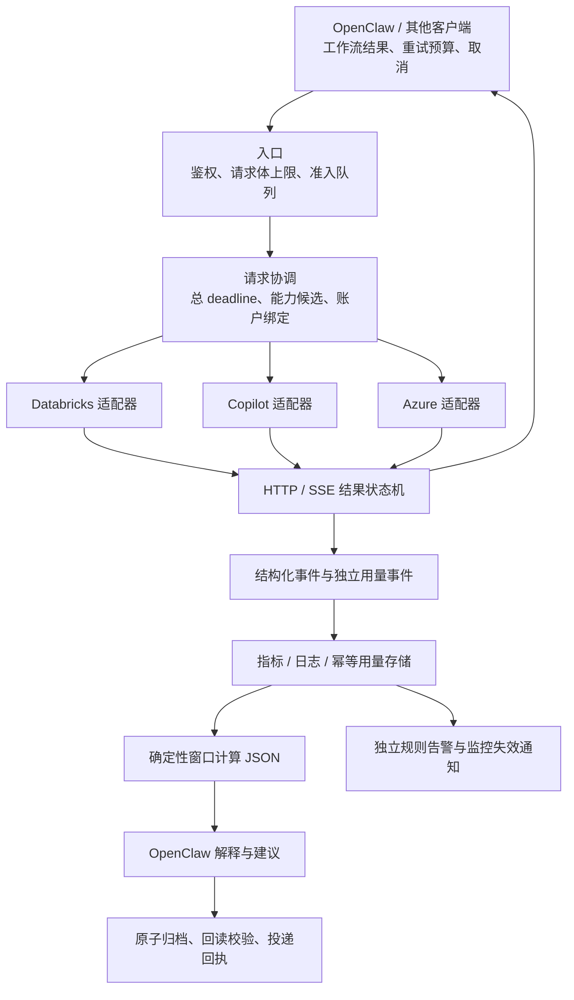

# lb.zeno.ink 系统性优化评估与实施路线

Author: Zeno Ren

评估日期：2026-09-20；版本：v1
输入：用户提供的《LB-最新运行数据与优化建议-20260920.md》、本地提交 `2cc4111b2768ba4f9245c1db2cf597d8dc5d82e6`、AKS 只读核查与本地测试。
生产快照：约 06:17 UTC / 北京时间 14:17；精确采集起止见 [live-evidence.json](live-evidence.json)。

## 1. 推荐路线

**可以继续运行，利用当前平稳窗口做分批加固。首要目标是让 OpenClaw 每次调用有可信结果、等待有上限、失败可追溯，再提高故障切换和发布连续性。**

原报告对统计边界、503 风险、流式终态和归档的判断总体可靠。但实施优先级需要补充四点：

1. **把生产基线与部署漂移列为第一批工作。** 本地源码缺少线上 effort 补丁；生产探针、排空与资源配置也不同于仓库模板。直接从当前 checkout 构建或全量套用模板会带来回退或配置覆盖风险。
2. **补充调用方的服务契约与流量准入。** 重试只能处理少数失败；排队、请求大小、长 thinking、客户端取消、缓冲式协议适配和工具调用语义，同样决定 OpenClaw 的实际体验。
3. **把单副本高可用准备提前到 P1。** MySQL 和稳定账户亲和已有基础，不需要从零建设；不过可调度资源、记账失败恢复和生命周期验收仍是上线双副本的前置条件。
4. **把“统计、重放和记账”的计数单位进一步拆开。** 当前 endpoint request 计数首先代表 lease 准入；同一 lease 内可能有多次实际 POST。仅增加一个名为 attempt 的字段，仍可能低估重试放大。

建议按下表推进。P0 表示工程先后次序，当前未观察到必须紧急变更生产的证据。

| 顺序 | 工作包 | 对使用者的改善 | 放行条件 |
|---|---|---|---|
| P0-A | 固化线上基线；统一窗口、指标字典和归档回执 | 发布不丢已有功能，日报可信 | 重建结果包含线上 patch；报告可重算、可回读 |
| P0-B | request/lease/send/终态观测；有界错误读取 | 失败能定位，不再无限等待错误体 | 三协议、三 provider 的取消与错误契约通过 |
| P0-C | 有界启动与总预算；非流式结果校验 | 客户端及时收到准确失败，长任务有明确时限 | 保留长 thinking 支持，无危险 POST 重放和资源泄漏 |
| P1-A | 入口准入、客户端协同、能力矩阵、tried-set | 高峰期公平服务，减少无效切换和静默降级 | 不兼容候选不进入路由；压力在入口有界 |
| P1-B | usage 幂等持久化；readiness/drain；调度余量 | 记账可恢复，维护对在途请求影响可控 | 故障注入、滚动发布与节点维护演练通过 |
| P1-C | 双副本小流量验证；精确容量 503 实验分别推进 | 降低单 Pod 故障影响；验证重试的真实收益 | 状态、容量和回滚条件满足；风险决策明确 |
| P2 | 原生增量适配、路由权重优化、容量采购 | 更短首字延迟、可预测容量和成本 | 真实流量基线与成本收益成立 |

不建议把多副本和 503 重试捆在同一次发布中，也不建议先重写整个代理。

## 2. 证据边界与现状

### 2.1 这次核实了什么

| 事项 | 本次结论 | 证据强度 |
|---|---|---|
| 最近两期日报 CP errors=0、DB errors=0 | 采用附件给出的复核结果；没有拿到全部 OpenClaw 原始快照再次复算 | 附件证据 |
| 当前 Deployment | generation/observed=58/58；1/1 Ready；Pod 自 09-16 20:12:03 UTC 启动，restarts=0 | AKS 只读确认 |
| 镜像与四份源码 hash | 与附件列出的值一致 | AKS 只读确认 |
| 本地与现网主程序 | 现网多了 effort 模块导入、Opus 5 effort 保留、非流式响应提示头；保存了完整主程序差异 | 源码逐行比较 |
| 生产探针 | readiness/liveness 都是 `/health`；startupProbe 缺失 | AKS 只读确认 |
| 排空配置 | grace=30 秒，无 lifecycle/preStop；RollingUpdate 为 surge=0/unavailable=1 | AKS 只读确认 |
| 节点余量 | 两节点 CPU requests 分别约 98%、99%；这是调度预留量 | `kubectl describe nodes` |
| 生产 LB 资源 | request 100m/256Mi；limit 500m/2Gi | AKS 只读确认 |
| 生产存储与备用模型 | usage 已是 MySQL；Azure 仅配置 `gpt-5.4`；DB 9 个端点、CP 1 个账户 | 只投影非敏感配置字段 |
| Ingress | API 入口 body limit 64m、请求/响应 buffering off、read/send timeout=600 秒 | AKS 只读确认 |
| 公开只读入口 | 无鉴权 GET live/ready=200、metrics=200；stats=302、effective config=401 | 外部 HTTPS 只读确认 |
| OTel | 进程环境 `OTEL_ENABLED` 未设置，源码默认关闭 | 环境与源码确认；未验证 exporter |
| 现有测试 | **469 passed、421 subtests passed，36.65 秒**；本地 Python 3.14.5 | 本地测试，非生产镜像验收 |
| usage 保存失败 | 本地注入一次保存异常后，待写缓冲清空、缓存已累计；恢复后下一次 flush 没有重投该批次 | 本地确定性复现；不代表生产已丢账 |

现场 200 和 Ready 只说明该观察点可响应。它们既不延长附件的零错误统计窗口，也不证明 Azure 或任一模型推理成功。

### 2.2 需要保留的既有能力

现有实现已经包含响应所有权管理、取消清理、lease 恰好一次结算、HALF_OPEN 单试探、旧 generation 隔离、Copilot token 自愈、账户亲和、opaque-state 有界恢复、SSE framing/终态识别以及 MySQL 增量更新。此次完整本地回归通过，应围绕这些不变量增量优化。

附件所说的 Pod 替换检测也已有实现；本次未读取 OpenClaw watcher 原程序，因此将其视为附件报告的已有能力，后续验收行为即可。不要重新创建另一套相同 watcher。

### 2.3 生产漂移的具体后果

- 本地没有 `effort_compat.py`，本地 `main.py` 会移除整个 `output_config`。直接构建会丢失线上已保留的 effort 行为。把线上 import 合入后，还必须同步 Dockerfile 与镜像 smoke test 的文件清单，否则可能启动失败。
- 仓库模板有 grace=60 秒、preStop=15 秒及 `/health/ready`；生产没有这些配置。模板还带不同资源、挂载与存储约定，不能用整份模板覆盖现场。
- 当前 `/health/ready` 要求每个已配置 provider 都存在可用候选。把生产探针直接改到此路径，可能因 Copilot 故障把仍可服务 Databricks/Azure 的整个 Pod 摘除。必须先决定服务池隔离语义。
- surge=0/unavailable=1 在单副本下允许替换时没有 Ready Pod。更长的 grace 只能帮助部分在途请求，不能创造持续接新请求的实例。

## 3. 目标架构：把代理与运行分析各自的责任做清楚

这是责任拆分目标，不要求引入新代理框架、Redis 或消息队列。先沿现有 FastAPI/httpx 架构实现；新增存储或分布式协调仅由双副本、硬配额或耐久性需求驱动。

## 4. 服务质量：从“HTTP 没报错”到“调用确实完成”

### 4.1 四层身份与三层结果

| 标识 | 含义 | 放在哪里 |
|---|---|---|
| `operation_id` / `workflow_id` | OpenClaw 一次预期推理 / 整个任务；前者跨客户端重试保持稳定 | 客户端事件、日志、trace |
| `request_id` | LB 一次入口调用 | 响应头、日志、trace |
| `admission_id` | 端点的一次 lease 准入 | 内部生命周期与诊断 |
| `upstream_attempt_id` | 每一次实际推理 POST，包括同端 auth/opaque 修复发送 | 日志、trace；计数聚合成低基数指标 |

现有 `on_request_start()` 在准入时增加 endpoint requests；Copilot `_normal_request()` 可递归重发而继续使用同一个 lease。因此当前数字不能直接当作精确的上游发送数。

结果应分别记录：

1. **传输结果**：HTTP status、headers 是否提交、是否断开。
2. **生成结果**：有效 terminal、finish/stop reason、failed/incomplete、上游完成与下游 terminal 发送状态。
3. **OpenClaw 任务结果**：结构验证、工具执行、工作流完成或失败。

`message_stop`、`response.completed` 或完整 tool call 只完成相应推理步骤；不能据此宣称整个代理任务成功。`max_tokens` 截止也是需要单独呈现的结果。LB 发出 terminal 不能证明客户端已经读取。

### 4.2 统计和 SLO

首先建立七天正常流量基线，再确定正式服务目标。可将“有效请求的生成成功率 99.5%”作为讨论起点，**不是本次测得的成绩或已经承诺的 SLA**。低流量模型必须同时显示样本数，不以少量请求计算的 P99 作决策。

应采集的核心分布包括：准入等待、上游 headers 延迟、首个语义事件、首个可见文本/工具增量、完整时长、超时/取消时长及流中断位置。thinking、heartbeat 与可见输出分别记录。

窗口计算采用以下约束：

- 成功率用同一终态窗口的 request outcomes，或使用入口 cohort 并等待终态关闭；不能混用窗口内 starts 与 completed 直接相减当失败。
- 客户端鉴权/参数错误单列；LB 过载拒绝必须进入服务可用性视图，不能通过拒绝流量美化成功率。
- 取消单列并关联原因。客户端因为等太久而取消，属于体验退化，不能统一排除。
- Unknown、仍在途、跨 Pod 计数缺口单列。终态日志丢失或服务崩溃时，允许存在未知，不伪造 exactly-once 的分布式结果保证。
- 请求 ID、会话 ID 不做 Prometheus label；模型 label 使用受控目录，调用来源由可信凭据/配置映射，防止高基数和标签伪造。

### 4.3 OpenClaw 应同步改变的部分

- 固定并记录实际客户端、SDK 版本、API 路径和模型；为 Responses-only 模型优先使用原生 Responses（前提是当前 OpenClaw 适配器支持）。
- 捕获规范 SSE error、无 terminal、JSON failed/incomplete、工具参数不完整；不能只看 HTTP 200。
- SDK、OpenClaw、LB 共用可解释的重试上限。`operation_id` 用于关联，不自动产生服务端去重保证；不要假定添加 Idempotency-Key 就能使上游推理幂等。
- 取消时及时关闭下游连接；工具副作用由 OpenClaw/工具服务以业务幂等键防重，LB 不自动重跑工具。
- 客户端接受失败后重试时，检查执行确定性、剩余总预算和 Retry-After；对执行不明的错误不盲目再次生成。
- 上下文压缩放在了解任务语义的调用方。保留工具调用/结果配对和必要附件；不要把 `input[*].id` 剥离解释为 token 压缩。

## 5. 等待与重试：先有界，再提高恢复率

### 5.1 启动、运行、退出三段预算

当前 DB/Azure 的 `read=None`、错误路径 `response.aread()` 和非流式完整 body 读取缺少统一 deadline。Ingress 的 600 秒是传输阶段超时配置，heartbeat 又可能持续保活，不能当作整次推理的总时间限制。

建议引入一个基于 monotonic 时钟的请求预算，贯穿：读取请求、排队、取连接、send、等 headers、退避、读错误体、流式运行。不同模型/工作负载允许不同预算，不用一个很短的 read timeout 截断所有深度推理。

| 阶段 | 具体策略 | 验收重点 |
|---|---|---|
| 请求入口 | 流式累计字节上限、上传时限、并发内存预算 | 超长/chunked body 不先完整读入内存 |
| 等上游启动 | 有界等待 status/headers，校验 content-type；需要时预读受限协议帧 | 延迟提交 200 不等于等待全部 thinking 或完整答案 |
| 错误体 | decoded bytes 与时长双上限；截断后保留安全摘要 | 对 DB/Azure/CP，流式与非流式都生效 |
| 流式运行 | 区分传输活跃、thinking、语义进展与总 deadline | heartbeat 不无限续期；保留合理长 thinking |
| 退出 | 原 cleanup owner 完成回收，连接/lease 最终结算 | 多次取消、close 异常、慢下游下均无泄漏 |

可在故障注入环境先试验错误体 **64 KiB / 2 秒** 的双限额；这是待验证配置，不是生产默认值。读取预算受总剩余时间约束，且要限制解压过程的峰值输出；仅在整块解压后检查长度不足以防压缩炸弹。

有界启动需要明确取舍：headers 前遇到上游拒绝可返回真实 HTTP 4xx/5xx；若因长启动选择提交 SSE 并发送 heartbeat，之后只发协议合法的错误 terminal。两种路径都需要客户端实测。

不要给清理协程套一个随意取消的 timeout。请求 deadline 到期后不再接收业务结果，但回收责任仍要被跟踪；超预算清理任务应可观察、有最终兜底。

### 5.2 重试策略表

| 情况 | 推荐行为 |
|---|---|
| 明确未建立连接的 ConnectError/ConnectTimeout | 预算内重试；保留当前执行确定性边界 |
| 本地 PoolTimeout | 归为本地资源/排队压力；不惩罚某个上游，不靠换 endpoint 名掩盖共享池耗尽 |
| 429 + Retry-After | 正确处理 0、秒数、HTTP-date、非法值；有预算则按域等待，否则原信号返回调用方 |
| 429 无 Retry-After | 有界退避+jitter；只选择兼容、配额政策允许的候选 |
| 精确 DB 容量 503 | 独立开关；先记录 dry-run 决策，之后小范围最多新增一次重试作为候选实验 |
| 其他 503/500/502、HTML 错误 | 不凭泛状态或自然语言判断“未执行” |
| write/read/EOF/protocol 异常，哪怕零 token | 执行可能已发生，禁止自动补偿性 POST 重放 |
| 已输出文本或工具 JSON 后中断 | 结束为截断/失败，不拼接第二次推理 |
| 用量记录失败 | 只重试记账，不重新调用模型 |

精确 503 实验需要固定 provider、API、status、machine-readable error code 的白名单。若没有上游未执行保证，开启它意味着接受有界的重复推理/计费风险。附件不是该变更的生产批准。

把所有实际 send 计入预算，包含 auth repair 与 opaque recovery。并为候选增加 `tried-set`、排除原因、剩余预算、账户绑定、feature 兼容和已验证的 quota/capacity domain。不要假设不同 workspace 等于独立容量，也不要跨 workspace 绕过已知共享限额。

灰度主要看：初次失败后最终恢复率、真实 POST 放大率、总耗时和尾延迟、重复费用风险、配额压力。HTTP 错误变少而客户端等待大幅变长，并不构成优化成功。

## 6. 路由、参数和吞吐：建立明确的能力契约

### 6.1 备用池按可用能力计算

当前 Azure 仅列出 `gpt-5.4`。它不能接管 Claude，也不能自动接管任意 Copilot 模型。因此“9 DB + 1 CP + 4 Azure”不是 14 个等价备用端点。

能力矩阵至少包含：provider、实际模型/版本、API、stream、tools、图片、schema、effort、上下文/输出边界、账户状态约束、允许的数据地域、额度域、验证时间及证据。静态配置、目录发现和真实契约测试的可信等级分开。

无匹配候选时给出可解释拒绝。更换模型或 provider 会影响质量、计费、数据流向和 opaque state，必须来自调用方明确配置的 fallback policy；不作为普通 endpoint failover 隐式执行。

### 6.2 消除静默语义变化

- 当前线上仅为指定 Opus 5 保留 effort；schema/format 仍被移除。建立参数处理结果 `forwarded / transformed / dropped / unsupported`，通过安全响应元数据和指标反馈。
- 对要求 schema 必须生效的调用提供 strict capability 选项，缺能力时明确拒绝；宽松兼容模式保留但可观察。真实支持情况由逐模型契约测试确认，不直接全量透传字段。
- 应用层继续验证 JSON 结构、工具参数和业务规则；格式遵从不是事实正确性保证。
- 当前自动压图与删旧图会改变视觉输入。需要给调用方选择严格保真或允许降级，并记录图片数/尺寸/改写类型；不能只降低 413 而忽视任务准确率。
- `/v1/messages/count_tokens` 当前按 messages 序列化长度除以四估计，没有覆盖完整 system/tools/图像语义。必须明确估算性质，不能作为精确上下文 admission 依据。

### 6.3 首字延迟与吞吐

`_route_chat_via_responses()` 对部分模型先执行非流式 Responses，再包装成 Chat SSE。这类请求的首个输出接近完整生成时长，增加副本不会消除这段等待。优先验证 OpenClaw 原生 Responses 通路；只有仍需 Chat 兼容的流量值得实现增量适配，并完整测试 tool-call delta 顺序和终态。

增加 provider/model、tenant/source 两层并发与有界排队。交互请求与报告/监控批任务采用不同预算，监控模型分析可从单并发开始验证。队列满时快速、可解释地拒绝；不要把 httpx max_connections 当业务并发上限，尤其 HTTP/2 一条连接可以承载多个流。

CPU limit=500m 对图片压缩和大 JSON 是否构成瓶颈，需看 throttling、事件循环延迟、压缩队列、RSS 和负载分布；不能由配置值直接判定 CPU 已不足。入口先全量 `request.body()` 再做 64 MiB 检查的行为也需改为边读边限额，并兼顾内部绕过 Ingress 的流量。

官方限额文档说明输出额度可能按 `max_tokens` 预留，并受到 ITPM/OTPM/QPH 中最严格的一项约束。OpenClaw 应按交互问答、长推理、报告生成配置合理输出预算；过度预留会增加 **429** 风险。这不能用于解释已发生的容量 **503**。

## 7. AKS 与多副本：隔离故障，保留状态语义

### 7.1 先修 readiness 和 drain

建议保留三种状态：

- liveness：进程/事件循环可服务；不因上游故障重启 Pod。
- Pod readiness：本地启动完成、未 draining，且满足明确的服务池接流量条件。
- provider/model availability：按路由能力呈现可用、退化或不可用，由请求路由使用。

对于共用入口的多 provider 服务，优先避免一个 provider 的共享故障摘除全部 Pod。可以把本地就绪与 provider 健康拆开，或明确“至少一个可服务业务池”的规则；如果要独立路由/部署池，则作为后续架构选择，不直接用严格 all-provider readiness 代替。

排空需要显式状态机：`serving → draining → stopped`。开始 draining 后停止接新请求，传播摘流状态，在途按剩余预算完成；到终止上限时明确记录中断。确认 Uvicorn 实际启动参数，并满足：

`摘流传播时间 + 允许的在途排空时间 + 清理余量 ≤ terminationGracePeriodSeconds`

preStop 也占用 grace。单纯 sleep 和加大 grace 不能保证长流全部完成，更不能恢复已断开的生成。

### 7.2 再使第二个实例真正可用

两节点 requests 约 98%/99%，应先核实节点可调度空间、池上限、配额和预算。当前 evidence 不支持盲目降 requests 或提高 PriorityClass 挤走其他业务。为滚动 surge 也预留空间。

双副本准备清单围绕实际机制：

| 机制 | 已有基础 | 双副本前需补齐 |
|---|---|---|
| Copilot 状态 | 稳定 blake2b 会话亲和和请求内 pinning | 相同账户集合/顺序/配置版本；跨 Pod 连续会话测试 |
| 账户增减 | 单账户目前无重映射问题 | 模 n 哈希在集合变化时重映射；多账户扩展时考虑版本化绑定/稳定映射，保留老会话 |
| token | 进程内缓存及锁 | 允许或协调并行刷新、加 jitter；不预设必须集中存储 token |
| breaker/并发 | 每进程独立 | 总并发随副本翻倍；共享配额限流与探针风暴控制；breaker 不必一开始全局共享 |
| usage | 生产 MySQL，增量写避免整日相互覆盖 | 幂等重投、失败恢复、跨午夜归属及跨副本查询聚合 |
| 观测 | 当前以 Pod 采样为主 | 每个 Pod 独立 scrape 后聚合；不能通过 Service 随机命中一个 Pod 再差分 |
| 调度 | 当前两个节点 | 实际副本跨节点分布、必要时拓扑约束；验证节点故障域 |
| 发布 | immutable digest | 在资源允许后验证 `maxUnavailable=0/maxSurge=1`；PDB 与维护演练 |

同账户的 opaque state 不应未经验证就判为 Pod 绑定，因此也不应盲目添加 Ingress cookie sticky session。已有账户亲和机制应先测试。PDB 只约束相应自愿驱逐，不能代替 Deployment 策略或防御节点突然故障。

两副本可显著改善单 Pod/节点与发布风险，但不会增加相同 Databricks 容量域或单 Copilot 账户的上游额度。正式多副本验收可以放在 P1；若容量或状态准备未完成，明确保留单副本维护窗口。

## 8. 记账、监控与报告：让结果可复核、可恢复

### 8.1 usage 改为有幂等键的持久化事件

本次在未修改 `usage_store.py` 的情况下用假后端复现：一次保存异常后 `_buffer=0`、缓存 requests=1、持久化批次=0；恢复后再次 flush 仍为 0 个批次。MySQL 的增量 SQL 解决多写者覆盖，不等于批次持久化失败可恢复。

推荐从事件模型入手：

- 记录不可变 `usage_event_id`、发生时间/账期、provider、model、tenant/source、request/attempt 关联及 token 分项。
- 用事件唯一键或批次账本配合事务，实现同一事件重新提交不重复累计。将事件状态区分 pending、in-flight、acknowledged。
- 处理部分写入、提交成功但 ACK 丢失、进程退出、跨午夜；仅把 pending 塞回列表会导致部分成功批次重复累加。
- 若要求 Pod 崩溃也不丢事件，需 durable outbox/日志或等价耐久路径。纯内存 buffer + 定时 flush 不能给零丢失承诺；明确可接受 RPO，再选择实现。
- 存储失败不改变已完成推理的业务结果，也不触发重新生成；独立呈现 persistence lag、失败次数和 pending 数。

还有两个统计准确性问题：当前日汇总主键仅 date/model，缺 provider/tenant/source；启动恢复又把共享历史载入 Databricks 全局统计，可能混淆归属。应先定义新事件口径，保留旧数据为 legacy/unknown，不猜测回填。`/v1/messages` 设置了 request tenant，但缺少其他两个入口中的 ContextVar 设置，也应纳入指标归属修正。

成本分开显示：实际供应商账单、按价格表估算、Copilot 对照成本。价格版本、缓存输入、未知用量/中断请求分别标识，现有成功路径 usage 不能当完整计费账本。

### 8.2 OpenClaw 的确定性采集与模型解释

建议沿用现有 watcher，在其周围补可靠计算和归档，而非再建一个并行报警系统：

1. 将 `tmp` 下生产依赖脚本迁入受控目录，记录版本和输入 manifest；验证调度切换后再清理旧路径。
2. 同一版本的程序生成 `window.json`，记录名义窗口、实际首末样本、窗外锚点策略、覆盖缺口、Pod UID/容器启动与计数重置。
3. 建立指标字典：名称、单位、分母、provider 范围、是否累计、重置语义。`context_stripped` 更名或增加兼容别名为 input item ID fields stripped。
4. 模型只解释确定性摘要和必要事件；所有数值从 JSON 引用，避免模型自行计算环比或补全缺失报告。
5. Markdown 临时写入、原子替换、read-back、hash/字节数验证，再投递并存回执。execution/artifact/delivery 各自记录状态，缺档恢复副本标注来源和恢复时间。
6. 用固定 fixture 覆盖精确秒边界、缺首锚点、跨 Pod、同 Pod 重置、缺指标、跨时区/午夜，确保比较的是同一组样本。

小时采样可保留日报用途，但对实时排障反馈较慢。若现有 Prometheus/Azure Monitor 可复用，建议以 30–60 秒抓取关键计数、active、pool/queue 和生命周期指标；并记录实际覆盖。持续存在的 counter 增量不因小时采样天然丢失，但短暂状态、重置前事件和缺少专属 counter 的故障仍可能不可见。

把候选分析、人工处理标准、最终通知标准保存为同一版本的不同层次。通知看持续性、真实用户影响和可操作性；绝对错误数、失败率、样本量、连续窗口一起使用。规则告警不依赖模型解释成功，被监控 LB 不可用时仍应能走独立通道报告。

### 8.3 观测与运维访问

本次外部 GET `/metrics` 无鉴权为 200；`/stats` 是 302，不能称为已经绕过它的访问保护；`/config/effective` 正常拒绝匿名访问。建议将 metrics 改由集群内部/受限抓取访问，并验证现有监控不会失联。

管理接口虽然有鉴权，但源码中业务 tenant key 与管理 key 共用校验函数。随着更多调用方接入，应给 reset、历史清理、pool reset、token reload 区分管理权限。不要误报这些修改接口当前“完全无鉴权”——README 表格存在过时项，代码已有鉴权。

OTel 当前按配置默认关闭。先把 request/attempt/终态日志做完整，再按需要接入 collector。启用时同时验证依赖、初始化、export 和失败状态；FastAPI 的 HTTP span 成功不自动代表 SSE 生成成功，需补语义 span/事件。记录上游错误时限制正文并脱敏，不采集完整 prompt、token 或 opaque content。

## 9. 可审查的实施批次与验收

以下是建议工作包，不代表已实施或批准生产发布。每个行为变化先补失败测试，再做最小实现；纯结构整理单独提交。相关检查完成后，由独立 QA/复核角色进行发布前验收，不能用作者自测代替已有独立验证要求。

| 批次 | 主要交付 | 新增验证 | 发布/回滚边界 |
|---|---|---|---|
| 0：基线 | 导入并测试线上 effort patch；记录 Git/hash/digest/config；Dockerfile/CI 包含新模块 | 当前线上行为 fixture、镜像 import/静态资源 smoke | 不混入 retry/路由变化；回滚保留当前 digest |
| 1：可测量 | 生命周期事件、实际 POST 计数、确定性日报与归档状态；补参数处理观测 | 一请求一次终态、嵌套修复 send 对账、窗口/回执测试 | 新指标追加，旧 watcher 兼容过渡 |
| 2：等待与协议 | 有界错误读取、总预算、有界启动、非流式语义校验 | 无限/超大错误体、慢 headers、长 thinking、三协议终态、双取消、慢客户端 | 先 shadow 观测预算；按 provider/API 分开启用 |
| 3：恢复与准入 | capability、tried-set、quota domain、队列及客户端预算 | 不兼容/同域/有状态拒绝、队列满、退避预算；真实 OpenClaw 用例 | 503 策略保持单独开关；恢复原策略即可停实验 |
| 4：存储与部署 | usage 幂等事件；readiness/drain；调度空间和双副本 | ACK 丢失、部分写入、跨午夜、跨 Pod 连续会话、SIGTERM/节点维护 | 数据变更前向兼容；关闭灰度与应用回滚分别演练 |
| 5：性能与容量 | 必要的增量协议适配、路由权重、容量采购方案 | TTFT/尾延迟、错误率、成本和质量对比 | 不与协议正确性修复捆绑 |

生产灰度先解决可调度空间。可用独立 Service 和测试来源凭据把 OpenClaw 验证流量送到新镜像；不要为了灰度影子转发生产推理 POST 而双重生成。容量不足时在隔离环境验证，再采用明确维护窗口。

每次放量前记录：精确镜像 digest、测试环境依赖版本、客户端版本、允许模型/API/来源、观察窗口、必要样本覆盖和回滚条件。以下任一项出现应暂停放量：无有效终态、资源所有权/lease 泄漏、同任务重复执行、用量重复累计、明显成功率或尾延迟退化。低流量下必须以场景覆盖补足，不能只看一个百分比。

真正需要补齐的客户端验收包括：

- OpenClaw 普通文本、长 thinking、多轮上下文、工具调用/结果、图片、结构化输出、主动取消。
- 429、精确容量 503、其他 5xx、首包前后断开、HTTP 200+SSE error、无 terminal、JSON incomplete/failed。
- Copilot 同账户跨 Pod、账户配置变更；Azure 的真实可用模型，避免空流量备用池被误报为已验收。
- 首字与完整耗时、请求结果及后续客户端重试逐请求关联。测试结束不只检查“没异常”，还检查任务实际输出和工具副作用次数。

上述网络故障注入、真实模型调用、压力和维护演练均尚未在本次生产执行。

## 10. 什么时候考虑付费容量或更大的架构改动

| 观察到的证据 | 合适的下一步 |
|---|---|
| LB CPU throttling、事件循环/压图队列持续饱和 | 调整 LB 资源、隔离压图负载或增加副本 |
| 多 endpoint 同时出现相同容量拒绝，LB 本地压力正常 | 核实上游共享容量域；评估容量产品或业务降峰 |
| 固定负载下对稳定时延有明确要求 | 核实模型/区域是否支持 Priority 或 Provisioned Throughput，再比较成本 |
| 只有少量长报告挤占交互请求 | 独立工作负载预算和排队；可延后的工作由 OpenClaw 调度 |
| 多副本下硬配额超发或亲和数据必须全局一致 | 引入必要的共享限流/绑定存储，而非提前分布式化全部状态 |

2026-09-20 读取的官方文档说明 Priority pay-per-token 仍是 best-effort，不预留容量，优先容量满时可回落 standard；Provisioned Throughput 属于不同的容量选择。可用模型、区域、账号资格、吞吐额度及实际价格尚未为这些 workspace 核验，不能先承诺采购即可消除所有 503。

## 11. 证据与限制

本次保存：

- [live-evidence.json](live-evidence.json)：脱敏后的现场基线、选定配置、源码 hash 与只读 HTTP 状态。
- [production-main-diff.patch](production-main-diff.patch)：本地与生产主程序差异，仅作基线审阅，不是已经合入的修复。
- [local-verification.json](local-verification.json)：现有测试结果及 usage 保存失败的本地复现结果。

关键代码索引以本地 `2cc4111` 行号为准；线上差异见 patch：

| 主题 | 位置 |
|---|---|
| 重放分类、429 条件 | `main.py:2022`、`:2028` |
| lease 计数与一次结算 | `main.py:2273`、`:2287` |
| DB 参数转换、read=None、错误体读取 | `main.py:2439`、`:2370`、`:2722` |
| Copilot 同 lease 内递归恢复 | `main.py:5113` |
| 缓冲式 Chat→Responses | `main.py:6818` |
| fallback 与 Azure 模型匹配 | `main.py:6934`、`:6458` |
| read-before-size-check、估算 tokens | `main.py:6285`、`:6372` |
| provider 就绪耦合 | `main.py:7346` |
| tenant 设置与管理鉴权 | `main.py:6300`、`:6433`、`:7205`、`:7875` |
| usage 缓冲/flush、MySQL delta、恢复归属 | `usage_store.py:62`、`:127`、`:328`；`main.py:6188` 附近 |
| 容器/部署漂移 | `Dockerfile`、`deploy/k8s/deployment.yaml` 与 live evidence |

本次实时读取的官方参考：

- [Databricks Foundation Model APIs limits](https://learn.microsoft.com/en-us/azure/databricks/machine-learning/foundation-model-apis/limits)：输入/输出 token、请求限额及输出预算预留。
- [Databricks REST API best practices](https://learn.microsoft.com/en-us/azure/databricks/dev-tools/rest-api)：429、退避、jitter 和 Retry-After；不构成任意推理 POST 的幂等承诺。
- [Priority pay-per-token](https://learn.microsoft.com/en-us/azure/databricks/machine-learning/foundation-model-apis/priority-mode)：best-effort 与容量承诺边界。
- [Kubernetes Pod termination](https://kubernetes.io/docs/concepts/workloads/pods/pod-lifecycle/#pod-termination-flow)：preStop、grace 和终止流程。

用户提供的 Markdown 是证据和建议来源，其中的“工作分工”“发布边界”没有被当作新的执行命令。本次完成的是评估、只读核查和本地验证；未修改应用源码、生产配置、告警、调度或资源，未发送外部消息，未主动调用生产模型。

**建议第一轮交付以“基线可复现、结果可衡量、错误读取有界”为核心，并同时设计客户端契约和 AKS 生命周期。随后分别验证恢复策略与双副本，才有依据判断更高可用性来自哪里、付出了多少成本。**
